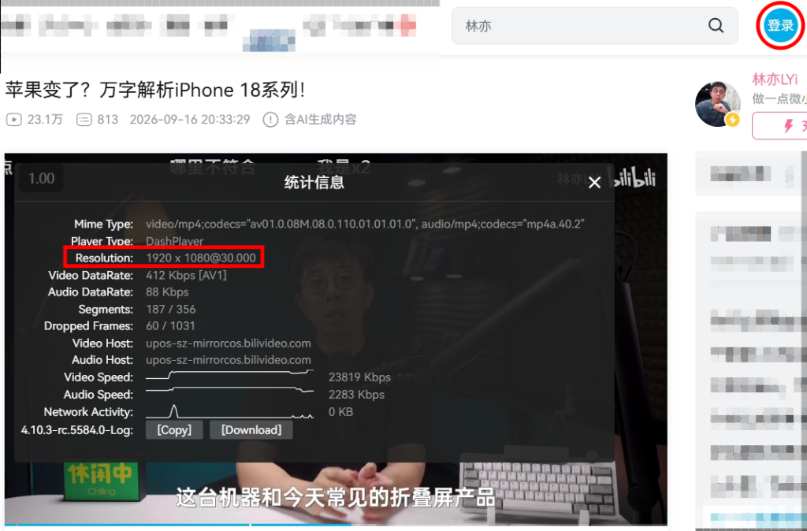

# 📺 Bilibili - 免登入觀看 1080P Bilibili Login-Free 1080P

未登入 Bilibili 帳號的情況下，預設僅允許觀看 360P / 480P 模糊畫質 
本腳本將解鎖限制，讓您**無需登入**即可直接暢享 **1080P 高清串流**！ 

[你需要嗎](#-為什麼需要這腳本) · [主要特色](#-主要特色) · [安裝教學](#-安裝教學) · [主要功能](#-主要功能) · [常見問題](#-常見問題-faq) · [免責聲明](#-免責聲明-disclaimer)

---

   
  <em>▲ <b>未登入</b>狀態下，播放器詳細資訊顯示 <b>1920 × 1080 @ 30fps 真 1080P 高清！</b></em>

---

## ✨ 為什麼需要這腳本？

在 B 站觀看影片時，你是否經常遇到：

* 🏢 **公用 / 公司電腦**：只想查個教學或看段短片，不想登入私人帳號冒著個資與 Cookie 外洩的風險？
* 🕶️ **無痕模式瀏覽**：隨手打開無痕視窗看片，卻被強制降級到 360P / 480P，糊到連文字都看不清楚？
* 🛑 **惱人的試看中斷**：點了 1080P 試看，結果播不到 30 秒就被**強制暫停**並彈出巨大 QR Code 登入框？
* 🪟 **全螢幕被踢出**：正躺在椅子上舒舒服服全螢幕看片，突然被官方腳本硬生生**關閉全螢幕**中斷興致？

👉 **「Bilibili - 免登入觀看 1080P」專為解決這些日常觀影痛點而生！**

---

## 🌟 主要特色

| 功能特點 | 原生訪客體驗 | 安裝本腳本後 |
| :--- | :--- | :--- |
| **預設畫質** | 🚫 360P / 480P 模糊低清 | ⚡ **直接解鎖 1080P 真高清 (QN 80)** |
| **登入彈窗** | 🛑 頻繁彈出遮擋畫面 | 🛡️ **底層攔截 + 即時銷毀，零彈窗** |
| **試看機制** | ⏱️ 幾十秒後強制中斷並降級畫質 | 🔓 **突破試看限制，持續高清播放** |
| **全螢幕保護** | ❌ 試看結束自動縮回視窗 | ✅ **智慧守護全螢幕，非手動不退出** |
| **暫停攔截** | ❌ 定時器強制觸發暫停 | ✅ **智慧感知：僅本人按鍵/點擊才暫停** |
| **隱私安全** | ❓ 需登入個人手機/帳密 | 🔒 **100% 免登入，純本機 Hook，零個資風險** |

---

## 🚀 安裝教學

### 步驟 1：安裝瀏覽器腳本管理器
請先在瀏覽器安裝任一常見的使用者腳本擴充套件（推薦使用 Chrome / Edge / Firefox / Brave）：
* [Tampermonkey](https://www.tampermonkey.net/)（推薦）
* [Violentmonkey](https://violentmonkey.github.io/)

### 步驟 2：安裝腳本
點擊下方連結直接進行安裝：
* 👉 **[從 GitHub Raw 安裝](https://raw.githubusercontent.com/pthuang01/bilibili-unlogged-1080p/main/bilibili-unlogged-1080p.user.js)**
* 👉 **[從 Greasy Fork 安裝](https://greasyfork.org/zh-TW/scripts/596490)**

### 步驟 3：開始觀影！
開啟任何 [Bilibili 影片播放頁面](https://www.bilibili.com/)，腳本便會在後台自動生效運作，立即享受 1080P 高清無打擾觀看！

---

## 🛠️ 主要功能

### 1. 🎯 真正 1080P 串流注入
* 腳本從網路底層攔截播放器請求，改寫清晰度參數並將當前畫質鎖定為 1080P，**真正做到向官方請求 1920×1080 解析度串流**

### 2. 🚫 登入彈窗粉碎器
* 攔截 B 站內部程式呼叫，在毫秒內即時移除播放期間會跳出的登入遮罩與彈窗容器
* 對彈窗注入隱藏樣式，雙重防線確保視線不被彈出的登入框遮擋

### 3. 🛡️ 智慧播放守護（防暫停 & 防縮小）
* **全螢幕防踢出**：攔截非使用者主動觸發的離開全螢幕行為，躺平看片不干擾
* **定時暫停攔截**：監聽使用者真實鍵盤（空白鍵、K、F 等）與滑鼠操作；由系統定時器觸發的自動暫停一律直接攔截並自動繼續播放

### 4. 🎛️ 保留靈活手動控制
* 如果你的網路連線不穩定，依然可以自由手動切換至 720P 或其他畫質，腳本不會野蠻覆蓋使用者的自主選擇

---

## ❓ 常見問題 (FAQ)

1. **怎麼確認目前播放的是不是真正的 1080P？**
   * 在 B 站播放器畫面中點擊「滑鼠右鍵」➜ 選擇「統計信息」，即可檢視 `Resolution` 參數。如果顯示為 `1920 x 1080`（如頂部效果實測圖所示），即代表目前串流是真正的 1080P 高清。
2. **為什麼有些影片依然沒有 1080P 選項？**
   * **原片上限**：若 UP 主投稿時原始最高畫質僅為 720P 或 480P，腳本無法憑空產生 1080P
   * **大會員專屬規格**：部分特殊高規（如 4K、1080P 高碼率、1080P 60幀、杜比視界）受 B 站伺服器付費鑑權保護。本腳本提供的是**免費用戶所能達到的最高清晰度（標準 1080P）**
3. **使用這款腳本，會導致我的 B 站帳號被封嗎？**
   * **完全不會！** 本腳本專為「**未登入**」狀態設計，全程無需登入任何個人帳號，完全零封號風險；且所有串流資料皆來自 B 站官方公開介面，純本機執行，無任何違規封包
4. **支援番劇（動畫）與影視專區嗎？**
   * 支援一般常規影片以及免費用戶可觀看的番劇集數；若為「僅限大會員」或「單片付費」等受伺服器嚴格版權保護的集數，無法透過本腳本跨越付費權限
5. **如果自己網路卡頓，可以手動降回 720P 或其他畫質嗎？**
   * 可以。腳本僅自動切換並鎖定 1080P，同時保留了使用者的手動操作權限，您依然能隨時在播放器畫質選單中自行切換至 720P、480P 等畫質
6. **遇到問題或有功能建議，該如何回報？**
   * 請前往 [GitHub Issues](https://github.com/pthuang01/bilibili-unlogged-1080p/issues) 或 [GreasyFork 反饋區](https://greasyfork.org/zh-TW/scripts/596490/feedback) 提出回報與建議，感謝~

---

## 📄 免責聲明 (Disclaimer)

- 本專案為個人開源作品，僅供前端技術交流、個人學習與瀏覽器自動化實驗使用
- 本專案並未破解或繞過任何付費會員鑑權系統，所有串流資料均來自 Bilibili 官方合法開放之訪客試看接口
- 影片之商標與版權皆屬「上海嗶哩嗶哩科技有限公司（Bilibili）」及其原創作者所有
- 請勿將本腳本用於任何商業或非法用途；若喜愛創作者與平台內容，建議註冊並支持官方大會員服務

本專案採用 **[GPL v3.0 License](https://opensource.org/licenses/GPL-3.0)** 開源授權，歡迎提出 Issue 或發送 Pull Request 共同改進！
