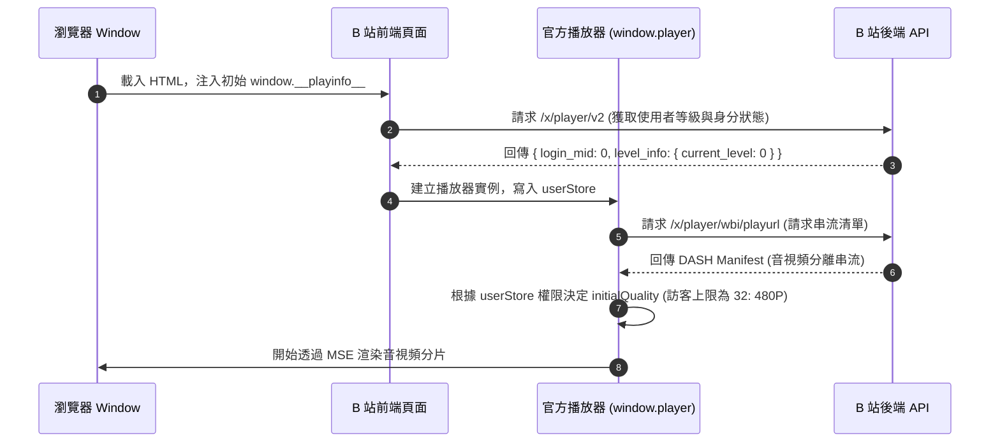
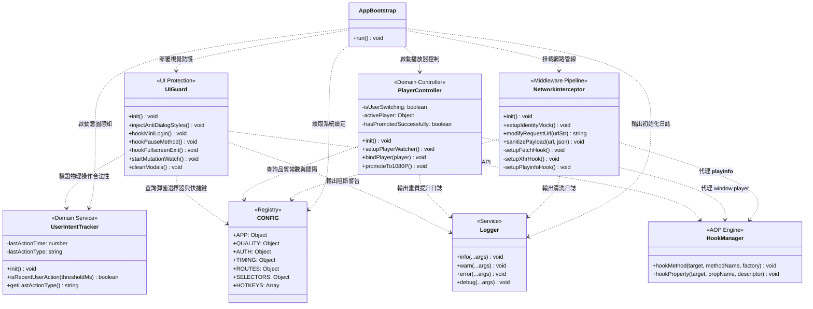

# Bilibili 免登入 1080P 高清播放引擎 — 技術白皮書
**Bilibili 1080P Unlogged Playback Engine: Comprehensive Technical Whitepaper & Engineering Manual**

- **文件版本**：v2.0.0
- **適用腳本**：`bilibili-unlogged-1080p.user.js` (Clean Architecture Edition)
- **維護者**：Antigravity & Senior Engineering Team
- **更新時間**：2026-09-20

---

## 目錄 (Table of Contents)

- [Bilibili 免登入 1080P 高清播放引擎 — 技術白皮書](#bilibili-免登入-1080p-高清播放引擎--技術白皮書)
  - [目錄 (Table of Contents)](#目錄-table-of-contents)
  - [第 1 章：專案總覽與架構設計哲學](#第-1-章專案總覽與架構設計哲學)
    - [1.1 業務痛點與專案使命](#11-業務痛點與專案使命)
    - [1.2 核心設計原則 (Clean Architecture \& Zero Overhead)](#12-核心設計原則-clean-architecture--zero-overhead)
  - [第 2 章：B 站播放器底層機制與逆向工程剖析](#第-2-章b-站播放器底層機制與逆向工程剖析)
    - [2.1 現代 B 站 HTML5 播放器架構概覽](#21-現代-b-站-html5-播放器架構概覽)
    - [2.2 四大失敗案例深度復盤 (Why Naive Approaches Failed)](#22-四大失敗案例深度復盤-why-naive-approaches-failed)
      - [失敗案例 A：前端自算 WBI 簽名重寫請求 $\\rightarrow$ 伺服器 `HTTP 412 Precondition Failed`](#失敗案例-a前端自算-wbi-簽名重寫請求-rightarrow-伺服器-http-412-precondition-failed)
      - [失敗案例 B：單純竄改 playurl 響應注入 1080P DASH $\\rightarrow$ 播放器報 `Permission denied` 強制降回 480P](#失敗案例-b單純竄改-playurl-響應注入-1080p-dash-rightarrow-播放器報-permission-denied-強制降回-480p)
      - [失敗案例 C：每 30 秒輪詢重載 playurl $\\rightarrow$ 畫面黑屏與音畫中斷](#失敗案例-c每-30-秒輪詢重載-playurl-rightarrow-畫面黑屏與音畫中斷)
      - [失敗案例 D：暴力覆蓋 `window.fetch` 與 `XMLHttpRequest` $\\rightarrow$ 遞迴死迴圈與業務癱瘓](#失敗案例-d暴力覆蓋-windowfetch-與-xmlhttprequest-rightarrow-遞迴死迴圈與業務癱瘓)
    - [2.3 四大成功突破核心技術點](#23-四大成功突破核心技術點)
  - [第 3 章：系統架構與 8 大模組設計規格](#第-3-章系統架構與-8-大模組設計規格)
    - [3.1 架構總覽與類別依賴圖 (Mermaid Class Diagram)](#31-架構總覽與類別依賴圖-mermaid-class-diagram)
    - [3.2 模組職責與介面規格剖析](#32-模組職責與介面規格剖析)
      - [3.2.1 `CONFIG`（常數與環境配置註冊表）](#321-config常數與環境配置註冊表)
      - [3.2.2 `Logger`（結構化日誌服務）](#322-logger結構化日誌服務)
      - [3.2.3 `HookManager`（安全 AOP 切面引擎）](#323-hookmanager安全-aop-切面引擎)
      - [3.2.4 `UserIntentTracker`（使用者意圖感知服務）](#324-userintenttracker使用者意圖感知服務)
      - [3.2.5 `NetworkInterceptor`（網路請求與數據淨化中介軟體）](#325-networkinterceptor網路請求與數據淨化中介軟體)
      - [3.2.6 `PlayerController`（播放器生命週期與畫質控制器）](#326-playercontroller播放器生命週期與畫質控制器)
      - [3.2.7 `UIGuard`（UI 與視覺防護員）](#327-uiguardui-與視覺防護員)
      - [3.2.8 `AppBootstrap`（應用啟動引導器）](#328-appbootstrap應用啟動引導器)
  - [第 4 章：開發者指南與除錯手冊](#第-4-章開發者指南與除錯手冊)
    - [4.1 零構建本機即時修改工作流](#41-零構建本機即時修改工作流)
    - [4.2 瀏覽器控制台除錯手冊 (`window.__BiliEngine__`)](#42-瀏覽器控制台除錯手冊-window__biliengine__)
      - [常用除錯指令：](#常用除錯指令)
    - [4.3 自動化驗證與檢驗標準 (客觀衡量指標)](#43-自動化驗證與檢驗標準-客觀衡量指標)
      - [標準檢驗四部曲：](#標準檢驗四部曲)
  - [第 5 章：維護手冊、故障排查與改版應對 SOP](#第-5-章維護手冊故障排查與改版應對-sop)
    - [5.1 常見故障徵兆與根因速查矩陣](#51-常見故障徵兆與根因速查矩陣)
    - [5.2 四大改版應對情境 SOP](#52-四大改版應對情境-sop)
      - [SOP-1：B 站更新 API 路由端點時](#sop-1b-站更新-api-路由端點時)
      - [SOP-2：B 站更新登入彈窗 CSS Class 或 DOM 階層時](#sop-2b-站更新登入彈窗-css-class-或-dom-階層時)
      - [SOP-3：B 站播放器改版重命名內部方法時](#sop-3b-站播放器改版重命名內部方法時)
      - [SOP-4：B 站試看參數變動或引入新型反爬機制時](#sop-4b-站試看參數變動或引入新型反爬機制時)
  - [第 6 章：資深工程師 Code Review 檢核清單](#第-6-章資深工程師-code-review-檢核清單)
  - [第 7 章：未來擴充指引與技術邊界](#第-7-章未來擴充指引與技術邊界)
    - [7.1 4K HDR 與杜比視界解鎖潛力評估](#71-4k-hdr-與杜比視界解鎖潛力評估)
    - [7.2 高碼率音訊 (Hi-Res / Dolby Atmos) 邊界](#72-高碼率音訊-hi-res--dolby-atmos-邊界)
    - [7.3 B 站風控與指紋防護機制考量](#73-b-站風控與指紋防護機制考量)
  - [第 8 章：附錄 (Appendix)](#第-8-章附錄-appendix)
    - [8.1 API 端點與查詢參數規格](#81-api-端點與查詢參數規格)
      - [1. 串流分片清單端點：`/x/player/playurl`](#1-串流分片清單端點xplayerplayurl)
      - [2. 使用者資訊端點：`/x/player/v2`](#2-使用者資訊端點xplayerv2)
    - [8.2 畫質 Quality ID (QN) 與編碼 (Codec) 對照表](#82-畫質-quality-id-qn-與編碼-codec-對照表)
    - [8.3 彈窗選擇器與按鍵代碼清單](#83-彈窗選擇器與按鍵代碼清單)
      - [攔截選擇器清單 (`CONFIG.SELECTORS.LOGIN_MODALS`)](#攔截選擇器清單-configselectorslogin_modals)
      - [意圖監聽快捷鍵清單 (`CONFIG.HOTKEYS`)](#意圖監聽快捷鍵清單-confighotkeys)

---

## 第 1 章：專案總覽與架構設計哲學

### 1.1 業務痛點與專案使命

Bilibili（以下簡稱 B 站）在未登入狀態下對訪客用戶實施了多重限制防線：
1. **訪客畫質鎖定**：預設僅開放 360P / 480P 串流，若嘗試選取 1080P 會強制彈出登入對話框
2. **30 秒試看陷阱與降級**：即便透過官方「試看 30 秒 1080P」功能，播放器內部定時器會在 30 秒時主動呼叫降級指令，將畫質強制降回 480P
3. **訪客身分看門狗 (Permission Denied)**：播放器內部的 `userStore` 會檢查 `/x/player/v2` 返回的 `login_mid`，未登入時為 `0`。一旦偵測到訪客請求大於 480P 的畫質，播放器將直接拒絕並降級
4. **60 秒阻斷彈窗與全螢幕中斷**：影片播放至約 1 分鐘時，頁面定時器會強制彈出 `bili-mini-mask` 登入彈窗、自動觸發 `HTMLVideoElement.pause()` 暫停播放，並調用 `Document.exitFullscreen()` 強制縮回一般視窗模式

**專案使命**：在不破壞任何官方合法權益的前提下，透過純客戶端執行期安全切面技術（AOP）與協定改寫，實現**未登入狀態下全程無感播放真 1080P 高清視頻**，同時杜絕定時降級、中途強制暫停與強制縮回全螢幕

### 1.2 核心設計原則 (Clean Architecture & Zero Overhead)

本專案拒絕「打補丁式」的義大利麵代碼，堅持採用軟體工程正規的高內聚、低耦合架構：

1. **單一職責原則 (Single Responsibility Principle, SRP)**：
   每個模組僅專注於一個領域。網路層不碰 DOM，UI 層不改寫播放器畫質狀態，意圖感知層只負責監控使用者物理輸入
2. **零構建成本 (Zero Build Overhead)**：
   拒絕引入 Webpack、Rollup、Vite、Babel 等重量級打包工具或 npm 依賴。全系統採用原生標準 ES6+ Class，保持**單一純 JavaScript 檔案**結構，大幅降低代碼審查門檻與維護摩擦力
3. **安全切面導向編程 (Safe AOP Engine)**：
   全面禁止在各處零散進行手動猴子補丁（Monkey Patching）。所有函數攔截與屬性代理必須經由 `HookManager` 統一調度，確保原生函數指針被妥善保存，杜絕遞迴重入、內存洩漏或原型鏈污染
4. **防禦性編程與平滑降級 (Defensive Programming)**：
   所有與 DOM、全域變數或異步 API 的互動均封裝於 `try-catch` 與環境感知檢測中。特別是在 `@run-at document-start` 階段，嚴格防範對尚未生成的 `document.head` 或 `document.documentElement` 進行無保護操作

---

## 第 2 章：B 站播放器底層機制與逆向工程剖析

### 2.1 現代 B 站 HTML5 播放器架構概覽

現代 B 站播放器為基於 DASH（Dynamic Adaptive Streaming over HTTP）與 MSE（Media Source Extensions）技術的客製化核心（`DashPlayer` / `bpx-player`）。其整體啟動與串流拉取時序如下：



### 2.2 四大失敗案例深度復盤 (Why Naive Approaches Failed)

在專案研發過程中，曾深入探討多種理論做法，但實測皆遭遇 B 站精密的防禦機制而宣告失敗。接手的工程師必須清楚這些死胡同，避免走回頭路：

#### 失敗案例 A：前端自算 WBI 簽名重寫請求 $\rightarrow$ 伺服器 `HTTP 412 Precondition Failed`
* **思路**：B 站在訪客請求時會訪問 `/x/player/wbi/playurl`。若在前端計算出正確的 `w_rid` 與 `wts` WBI 簽名，並附加 `qn=80`，是否能直接拿到 1080P？
* **失敗根因**：B 站伺服器對 `/x/player/wbi/playurl` 實施了嚴格的 Pre-condition 檢查。當前端未帶合法 Cookie 或簽名參數與伺服器時間戳/指紋略有偏差時，後端網關會立即阻斷並回傳 `HTTP 412: Precondition Failed`，導致播放器完全無法解析串流並引發崩潰

#### 失敗案例 B：單純竄改 playurl 響應注入 1080P DASH $\rightarrow$ 播放器報 `Permission denied` 強制降回 480P
* **思路**：在 Fetch / XHR 攔截中，將 `playurl` 回傳的 DASH 資料強行替換為包含 1080P（QN 80）的分片資料
* **失敗根因**：這是導致「肉眼看起來只有 480P」的假性播放元兇！雖然網路層注入了 1080P 串流，但 B 站播放器內部的 `userStore` 會檢查 `/x/player/v2` 接口返回的 `login_mid`。若為訪客（`login_mid: 0`），播放器核心程式碼判定該用戶無權播放高於 480P 的畫質，在內部拋出 `Permission denied` 異常，並在 1 秒內強制呼叫降級邏輯重置回 480P

#### 失敗案例 C：每 30 秒輪詢重載 playurl $\rightarrow$ 畫面黑屏與音畫中斷
* **思路**：既然未登入有 30 秒試看機制，是否能透過計時器每 30 秒重新調用一次試看介面？
* **失敗根因**：重載 playurl 會觸發 MSE SourceBuffer 的全量清空（`SourceBuffer.abort()`）與播放器重新握手，造成長達 1～2 秒的黑屏旋轉菊花圖與音訊爆音，完全違反「無感播放」的使用者體驗承諾

#### 失敗案例 D：暴力覆蓋 `window.fetch` 與 `XMLHttpRequest` $\rightarrow$ 遞迴死迴圈與業務癱瘓
* **思路**：在最外層直接使用自製函數取代 `window.fetch`
* **失敗根因**：B 站頁面載入大量第三方 SDK（如日誌上報、Sentry、埋點探針）。未經封裝的暴力覆蓋極易導致重複攔截、請求鏈丟失、或在 `fetch` 內部再次調用 `fetch` 引發堆疊溢位（Stack Overflow）

---

### 2.3 四大成功突破核心技術點

v2.0.0 版本的架構之所以能穩定輸出真 1080P，關鍵在於下列四位一體的技術突破：

1. **乾淨端點改寫 (Clean Endpoint Redirection)**：
   將所有導向 `/x/player/wbi/playurl` 的請求，平滑重定向至無 WBI 風控限制的 `/x/player/playurl`，並附帶 `qn=80&try_look=1&fourk=1&fnval=4048&fnver=0`。伺服器直接穩定回傳 `HTTP 200 OK`，合法取得未登入的 1080P DASH 完整分片
2. **訪客身分偽裝 (Identity Mocking)**：
   在網路層中介軟體同時攔截 `/x/player/v2` 與 `/x/player/wbi/v2` 響應，將 `data.login_mid` 與 `data.mid` 偽裝為合法用戶 ID（`10000000`），並將用戶等級設為 Lv6。**播放器 `userStore` 的權限看門狗被徹底解除**，不再拋出 `Permission denied`
3. **底層畫質控制器接管 (Downgrade Interception via PlayerController)**：
   當官方 30 秒試看計時結束時，B 站定時器會調用 `player.requestQuality(32)`。本引擎透過代理該方法，當偵測到目標畫質 $< 80$ 且非使用者手動切換時，**直接在底層阻斷調用並回傳已解決的 Promise**，牢牢將畫質鎖死在 1080P
4. **使用者真實意圖感知 (Intent Discrimination via UserIntentTracker)**：
   監聽用戶物理輸入（滑鼠點擊、雙擊、全螢幕熱鍵等），提供 500ms 意圖窗口。只有在該窗口內的 `exitFullscreen()` 或 `pause()` 才會被放行；所有由頁面定時器在 60 秒時發起的程式化退出全螢幕與暫停，一律靜默攔截

---

## 第 3 章：系統架構與 8 大模組設計規格

### 3.1 架構總覽與類別依賴圖 (Mermaid Class Diagram)

系統嚴格遵循單一依賴方向，由 `AppBootstrap` 負責組合裝配各模組：



---

### 3.2 模組職責與介面規格剖析

#### 3.2.1 `CONFIG`（常數與環境配置註冊表）
* **職責**：集中宣告整個腳本運行所需的所有魔術數字（Magic Numbers）、路由常數、偽裝身分、選擇器與計時門檻
* **安全性設計**：外部使用 `Object.freeze` 封裝，防止運行期間被意外竄改
* **主要鍵值**：
  - `QUALITY.FHD_1080P = 80`：B 站標準 1080P 高清標識
  - `QUALITY.SD_480P = 32`：訪客預設上限
  - `AUTH.FAKE_MID = '10000000'`：偽裝的合法用戶 UID
  - `TIMING.USER_ACTION_EXPIRY_MS = 500`：判定使用者物理點擊的有效時間差
  - `SELECTORS.LOGIN_MODALS`：攔截的彈窗 CSS 選擇器清單

#### 3.2.2 `Logger`（結構化日誌服務）
* **職責**：標準化控制台輸出格式，統一加上 `[Bili-1080P v3.0]` 前綴
* **除錯開關**：`debug()` 方法依賴 `window.__BILI_DEBUG__` 旗標。預設不污染開發者控制台，僅在偵錯模式下輸出詳細調試追蹤

#### 3.2.3 `HookManager`（安全 AOP 切面引擎）
* **職責**：提供純淨的函數與屬性劫持介面，是整個腳本的底層基礎設施
* **介面規格**：
  ```javascript
  HookManager.hookMethod(target, methodName, (originalMethod) => {
    return function (...args) {
      // 切面邏輯
      return originalMethod.apply(this, args);
    };
  });

  HookManager.hookProperty(target, propName, {
    get() { /* getter */ },
    set(val) { /* setter */ }
  });
  ```
* **設計要點**：自動檢驗目標物件與方法是否存在，失敗時安全記錄日誌，絕不拋出未捕獲例外中斷主流程

#### 3.2.4 `UserIntentTracker`（使用者意圖感知服務）
* **職責**：監聽瀏覽器全域事件，記錄最後一次合法物理操作的時間戳與類型
* **監聽事件**：`click`、`pointerdown`、`dblclick`，以及熱鍵（`Space`, `KeyF`, `KeyK`, `KeyW`, `Escape`）
* **核心方法**：
  - `isRecentUserAction(thresholdMs = 500)`：若當前時間與最後一次物理操作相差在門檻內，回傳 `true`

#### 3.2.5 `NetworkInterceptor`（網路請求與數據淨化中介軟體）
* **職責**：全方位管線式處理三大網路資料通道：`window.fetch`、`XMLHttpRequest`、以及首頁伺服器渲染注入的 `window.__playinfo__`
* **核心管線**：
  1. `modifyRequestUrl(urlStr)`：若偵測到 `/wbi/playurl`，轉換為乾淨的 `/playurl`，並補足 `qn=80&try_look=1&fourk=1&fnval=4048&fnver=0`
  2. `sanitizePayload(url, json)`：
     - 若為 `/playurl`：將 `data.quality` 設為 80，確保 `accept_quality` 包含 1080P
     - 若為 `/x/player/v2` 或 `/x/player/wbi/v2`：將 `data.login_mid` 與 `data.mid` 注入 `10000000`，瓦解權限看門狗

#### 3.2.6 `PlayerController`（播放器生命週期與畫質控制器）
* **職責**：監控並綁定官方播放器實例，調度畫質升級並阻斷試看降級
* **守門人與自動升級機制**：
  - 透過 `HookManager.hookProperty(win, 'player', ...)` 即時捕獲播放器實例
  - 配合 `setInterval` 守門人計時器（每 1000ms），確保 SPA 單頁換集或延遲載入時不丟失綁定
  - **多階段升級保障**：分別於實例綁定後 1.2s、DOM Video `canplay` / `loadeddata` / `play` 事件、以及守門人檢測到 `video.currentTime > 0.5` 且 `realQ !== 80` 時自動調用 `promoteTo1080P()`
  - **降級攔截**：代理 `player.requestQuality`，若目標 `qn < 80` 且非使用者手動操作，直接阻斷並返回 `Promise.resolve()`

#### 3.2.7 `UIGuard`（UI 與視覺防護員）
* **職責**：消除任何對使用者觀看造成干擾的視覺元素與非自願中斷
* **關鍵防護機制**：
  1. **非同步樣式注入**：防範 `@run-at document-start` 時 `document.head` 尚未就緒的問題，透過自旋輪詢與 `DOMContentLoaded` 安全掛載隱藏樣式
  2. **miniLogin 阻斷**：攔截 `window.miniLogin.show()` 與 `window.miniLogin.regist()`，使其靜默返回
  3. **非自願 pause 攔截**：劫持 `HTMLVideoElement.prototype.pause`，非使用者操作且非影片播畢時，忽略暫停請求
  4. **非自願 exitFullscreen 攔截**：劫持 `Document.prototype.exitFullscreen`（及各瀏覽器廠商前綴方法），阻斷定時器退全螢幕行為
  5. **DOM MutationObserver**：即時銷毀任何動態插入的 `bili-mini-mask` 彈窗 DOM，若影片被誤暫停則自動喚醒播放

#### 3.2.8 `AppBootstrap`（應用啟動引導器）
* **職責**：遵循依賴拓撲順序初始化各模組，並將核心模組以唯讀形式掛載至全域 `window.__BiliEngine__`，供開發者與維護工程師即時除錯

---

## 第 4 章：開發者指南與除錯手冊

### 4.1 零構建本機即時修改工作流

本專案採用純原生 ES6+ 結構，無需任何編譯或打包管線。維護工程師修改腳本後的驗證工作流極為簡潔：


1. 在編輯器（VS Code 等）中直接開啟並編輯 `bilibili-unlogged-1080p.user.js`
2. 保存檔案
3. 切換至瀏覽器 B 站影片分頁，按下 **F5（或 Ctrl+F5）重新整理頁面**
4. 修改立即生效，無須任何 `npm run build` 或重新打包步驟！

---

### 4.2 瀏覽器控制台除錯手冊 (`window.__BiliEngine__`)

為了方便資深工程師在線上環境即時分析問題，本腳本在全域暴露了 `window.__BiliEngine__` 偵錯命名空間：

#### 常用除錯指令：

```javascript
// 1. 開啟詳細偵錯日誌
window.__BILI_DEBUG__ = true;

// 2. 查看當前核心配置註冊表
console.table(window.__BiliEngine__.CONFIG.QUALITY);
console.log(window.__BiliEngine__.CONFIG.SELECTORS.LOGIN_MODALS);

// 3. 檢查最後一次使用者操作意圖
console.log({
  lastType: window.__BiliEngine__.UserIntentTracker.getLastActionType(),
  isRecent: window.__BiliEngine__.UserIntentTracker.isRecentUserAction()
});

// 4. 檢查官方播放器當前內部畫質狀態
const q = window.player.getQuality();
console.log(`即時畫質 realQ: ${q.realQ} | 目標畫質 nowQ: ${q.nowQ}`);

// 5. 手動觸發一次 1080P 升級調度
window.__BiliEngine__.PlayerController.promoteTo1080P();

// 6. 手動強制清理畫面上所有殘留登入彈窗
window.__BiliEngine__.UIGuard.cleanModals();
```

---

### 4.3 自動化驗證與檢驗標準 (客觀衡量指標)

驗證本腳本是否正常工作，請勿單憑肉眼猜測，必須以瀏覽器「**视频统计信息**」面板與 DOM 底層屬性為客觀判定標準：

#### 標準檢驗四部曲：
1. **未登入狀態驗證**：頁面右上角必須清晰呈現藍色【**登录**】按鈕（確認未攜帶會員身分）
2. **調出統計信息**：在影片播放畫面中點擊滑鼠右鍵，在右鍵選單點擊【**视频统计信息**】
3. **Resolution 核驗**：面板中的 `Resolution` 必須呈現 **`1920 x 1080@30.000`**（或 60.000），不可為 $852 \times 480$ 或 $640 \times 360$
4. **控制台物件核驗**：在 Console 執行 `window.player.getQuality()`，其物件屬性必須滿足：
   ```json
   {
     "nowQ": 80,
     "realQ": 80
   }
   ```
   且 `document.querySelector('video').videoWidth === 1920`

---

## 第 5 章：維護手冊、故障排查與改版應對 SOP

### 5.1 常見故障徵兆與根因速查矩陣

| 故障徵兆 (Symptom) | 潛在根本原因 (Root Cause) | 排查與修復指引 |
| :--- | :--- | :--- |
| **畫面清晰度停在 480P，且統計信息顯示 852x480** | 1. `/x/player/v2` 攔截失效，`login_mid` 未偽裝成功，觸發 Permission Denied。<br>2. `modifyRequestUrl` 未注入 `try_look=1`。 | 檢查 Network 面板中的 `v2` 介面響應，確認 `data.login_mid` 是否為 `10000000`。檢查 `NetworkInterceptor.sanitizePayload` 邏輯。 |
| **影片播放到 60 秒時突然暫停** | 頁面定時器觸發了新型暫停邏輯，或 `HTMLVideoElement.prototype.pause` 劫持被後續腳本覆蓋。 | 檢查控制台是否有 `Blocked programmatic pause()` 日誌。確認 `HookManager.hookMethod` 是否在播放器載入前生效。 |
| **影片播放到 60 秒時全螢幕被自動退出** | B 站更換了退出全螢幕的方法名稱（如使用了新版全螢幕 API 或客製化容器偽全螢幕）。 | 檢查 `UIGuard.hookFullscreenExit`。若 B 站使用網頁全螢幕（WebFullscreen），需同步監控播放器全螢幕按鈕或 CSS class。 |
| **畫面上彈出半透明灰色遮罩或登入框** | B 站更新了登入彈窗的 DOM class 名稱，導致現有 CSS 與 MutationObserver 未涵蓋。 | 使用瀏覽器 DevTools Elements 面板檢查彈窗容器的 Class 名稱，將新 Selector 加入 `CONFIG.SELECTORS.LOGIN_MODALS`。 |
| **控制台報 `Cannot read properties of null (reading 'appendChild')`** | 腳本在 `document-start` 執行，在 DOM 尚未解析時提早訪問了 `document.head`。 | 確保使用 `UIGuard.injectAntiDialogStyles` 的自旋與 `DOMContentLoaded` 延遲保護機制。 |

---

### 5.2 四大改版應對情境 SOP

當 B 站前端或後端進行版本迭代時，維護工程師應依據以下標準作業程序（SOP）進行應對：

#### SOP-1：B 站更新 API 路由端點時
1. 開啟 DevTools Network 面板，過濾 `playurl` 與 `player`
2. 檢查請求的 Request URL 路徑變更（例如路徑前綴變更為 `/x/player/v3` 或新的微服務網關）
3. 前往 `CONFIG.ROUTES`，更新對應常數（例如 `ROUTES.CLEAN_PLAYURL`）
4. 在 `NetworkInterceptor.modifyRequestUrl` 中確保正規表示式匹配新端點

#### SOP-2：B 站更新登入彈窗 CSS Class 或 DOM 階層時
1. 觸發彈窗出現，在 DevTools 中暫停腳本執行（Sources 面板按 F8 或利用 DOM 断點）
2. 檢查彈窗根節點與遮罩節點的 Class、id 或 `data-*` 屬性
3. 將新選擇器加入 `CONFIG.SELECTORS.LOGIN_MODALS` 陣列
4. 同步檢查 `UIGuard.startMutationWatch()`，確保 `MutationObserver` 包含對新 Class 的快速銷毀判斷

#### SOP-3：B 站播放器改版重命名內部方法時
1. 在控制台輸入 `console.dir(window.player)`，檢視播放器原型鏈上的方法名
2. 若 `requestQuality` 被改名為例如 `switchQuality`、`setQuality` 或混淆名稱：
   - 搜尋播放器打包檔案中包含 `Permission denied` 或畫質數字 `80` 的呼叫點
   - 在 `PlayerController.bindPlayer` 中更新代理方法目標
3. 確保自動升級方法 `promoteTo1080P()` 呼叫新的方法名稱

#### SOP-4：B 站試看參數變動或引入新型反爬機制時
1. 使用完全無外掛的乾淨瀏覽器訪客無痕模式開啟 B 站影片
2. 點擊官方「試看 30 秒 1080P」，在 Network 面板中抓取其發出的 `playurl` 請求
3. 比較其 URL 查詢參數與本腳本 `CONFIG` 中的差異（特別是 `try_look`、`fnval`、`fourk`、`fnver` 等旗標）
4. 同步更新 `NetworkInterceptor.modifyRequestUrl()` 中的 URL 參數組裝邏輯

---

## 第 6 章：資深工程師 Code Review 檢核清單

任何向本專案提交的 Pull Request 或代碼修訂，必須通過以下嚴格檢核：

- [ ] **單檔純淨度**：是否維持純原生 ES6+ 單檔結構？嚴禁引入任何 npm 外部相依性或打包工具
- [ ] **零語法錯誤**：提交前必須通過 `node --check "bilibili-unlogged-1080p.user.js"` 靜態語法檢驗，返回碼必須為 0
- [ ] **AOP 安全規範**：新增的 Hook 是否全數透過 `HookManager` 執行？嚴禁使用非受控的 `window.xxx = ...` 裸覆蓋
- [ ] **意圖隔離**：任何涉及阻斷 `pause` 或 `exitFullscreen` 的邏輯，是否均嚴格經過 `UserIntentTracker.isRecentUserAction()` 判定？嚴禁破壞使用者主動暫停或主動退出的自由意志
- [ ] **生命週期安全**：在全域執行體與 `init()` 階段，是否絕不直接對 DOM 節點進行無保護的同步取值？
- [ ] **日誌規範**：是否嚴格使用 `Logger` 服務？非致命警告必須降為 `Logger.warn` 或 `Logger.debug`，嚴禁濫用 `console.log`
- [ ] **實測驗證**：是否在未登入狀態下實際運行並驗證「视频统计信息」呈現 `1920x1080@30.000`？

---

## 第 7 章：未來擴充指引與技術邊界

### 7.1 4K HDR 與杜比視界解鎖潛力評估

* **技術可行性分析**：
  B 站 4K（QN 120）、1080P 60幀（QN 116）、4K HDR（QN 125）與杜比視界（QN 112）目前屬於大會員（VIP）專屬資產
* **技術邊界與限制**：
  與 1080P 不同，4K 與 HDR 串流在伺服器端實施了**真正的分片密鑰簽名與 Token 驗證**（包含特定會員 Session 綁定與 CDN 鑑權）。單純在訪客端竄改 `qn=120`，伺服器在分片拉取階段會回傳 `403 Forbidden`

### 7.2 高碼率音訊 (Hi-Res / Dolby Atmos) 邊界

* 目前腳本穩定取得 1080P 配套之標準 AAC 107~128 Kbps 音訊串流（`mp4a.40.2`）
* 更高階的 Hi-Res（FLAC 無損）與杜比全景聲串流（`audio_codecid: 30280`）亦需要對應會員身分標籤，強行請求將引發音訊回退或靜音

### 7.3 B 站風控與指紋防護機制考量

* **IP 頻率限制**：本腳本採用「非輪詢、單次合法握手」策略，只在頁面初次載入時發出乾淨 playurl 請求，**完全不會對 B 站伺服器造成額外負載**，IP 風控風險極低
* **Cookie 與指紋**：腳本僅在未登入時安全寫入訪客標識 Cookie（`DedeUserID=10000000`），不涉及任何跨站追蹤或使用者個人隱私數據收集

---

## 第 8 章：附錄 (Appendix)

### 8.1 API 端點與查詢參數規格

#### 1. 串流分片清單端點：`/x/player/playurl`
- `qn` (int): 目標畫質，固定傳入 `80` (1080P)
- `try_look` (int): 試看標識，固定傳入 `1`
- `fourk` (int): 4K 兼容標識，傳入 `1`
- `fnval` (int): 串流格式旗標，傳入 `4048`（請求 DASH 格式及各類主流 Codec）
- `fnver` (int): 格式版本，傳入 `0`

#### 2. 使用者資訊端點：`/x/player/v2`
- 響應清洗關鍵欄位：
  - `data.login_mid = 10000000` (Number)
  - `data.mid = 10000000` (Number)
  - `data.level_info.current_level = 6` (Number)

---

### 8.2 畫質 Quality ID (QN) 與編碼 (Codec) 對照表

| Quality ID (QN) | 畫質名稱 | Codec 名稱與標識 | 未登入狀態可用性 |
| :---: | :---: | :---: | :---: |
| **80** | **高清 1080P** | **AV1 (`av01`) / HEVC (`hev1`) / AVC (`avc1`)** | **本引擎完全解鎖支援** |
| 64 | 高清 720P | 同上 | 本引擎完全解鎖支援 |
| 32 | 清晰 480P | 同上 | 官方未登入預設上限 |
| 16 | 流暢 360P | 同上 | 官方訪客最低畫質 |
| 112 | 杜比視界 | Dolby Vision (Profile 5/8) | 需大會員 CDN 授權 |
| 120 | 超清 4K | 4K UHD | 需大會員 CDN 授權 |

---

### 8.3 彈窗選擇器與按鍵代碼清單

#### 攔截選擇器清單 (`CONFIG.SELECTORS.LOGIN_MODALS`)
- `.bili-mini-mask`
- `.bili-mini-login-right-wp`
- `.bili-mini-content-wp`
- `.bpx-player-dialog-wrap[data-type="trial"]`
- `.bili-player-trial-wrap`
- `.bpx-player-trylook-wrap`
- `.bpx-player-dialog-trylook`
- `.bpx-player-trylook-tip`
- `.login-panel-pop`
- `.passport-login-container`

#### 意圖監聽快捷鍵清單 (`CONFIG.HOTKEYS`)
- `Space`（暫停/播放）
- `KeyK`（暫停/播放）
- `KeyF`（全螢幕切換）
- `KeyW`（網頁全螢幕切換）
- `KeyT`（劇院模式切換）
- `Escape`（退出全螢幕）
- `MediaPlayPause`（多媒體播放/暫停鍵）

---

*(本文件由 Antigravity 團隊自動產出並維護，遵循 Clean Architecture 規範)*
